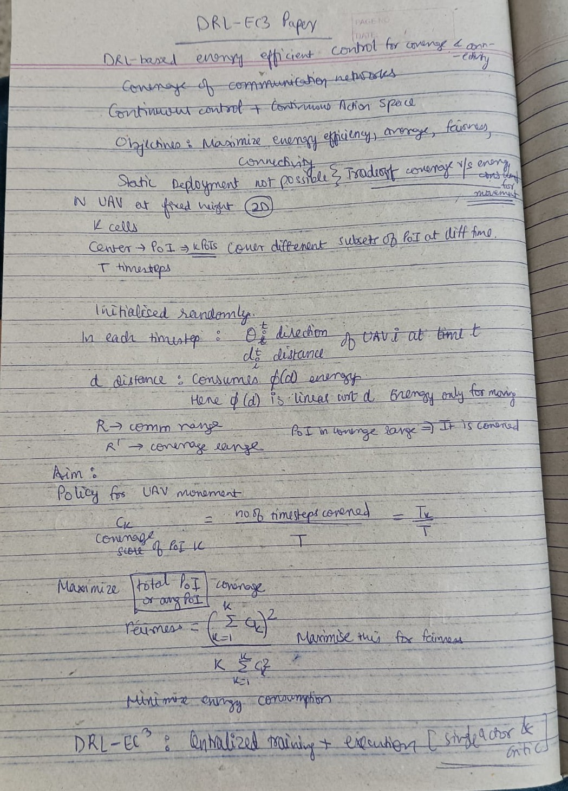
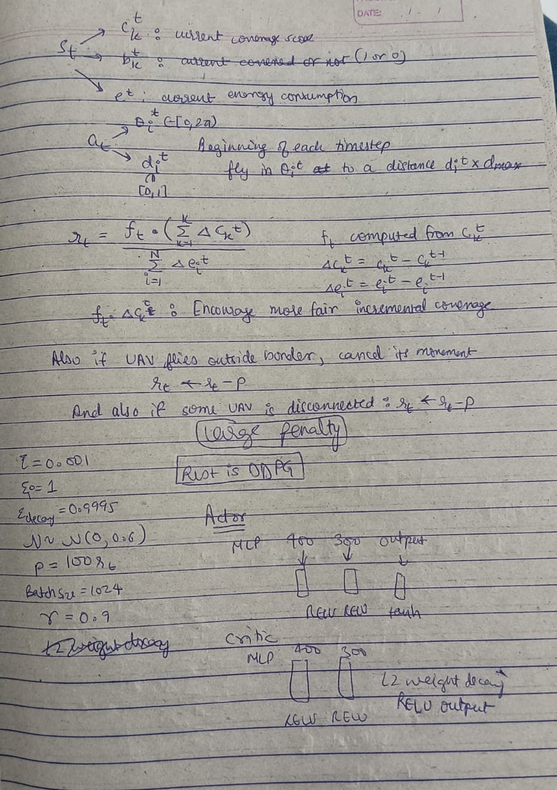
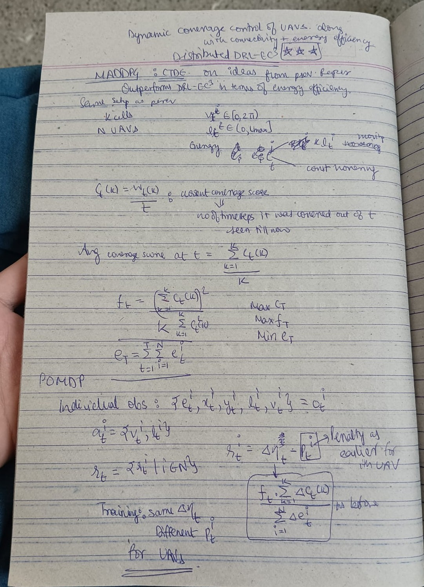
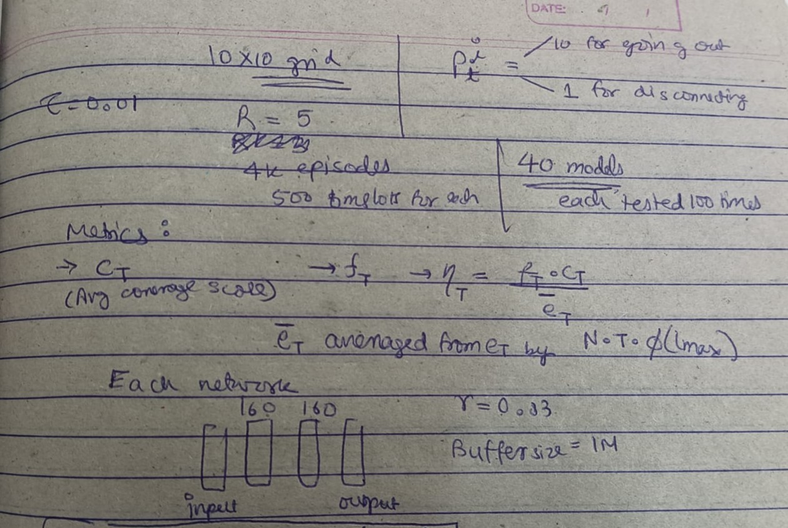
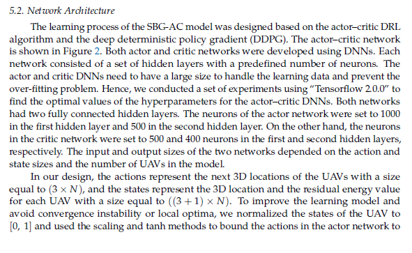
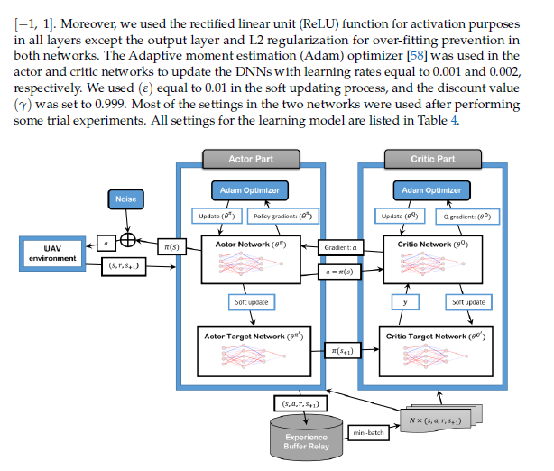
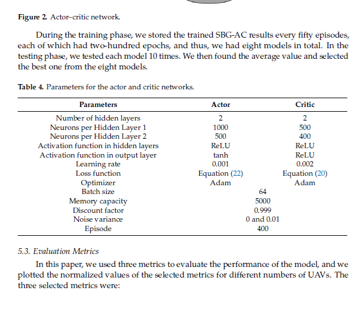
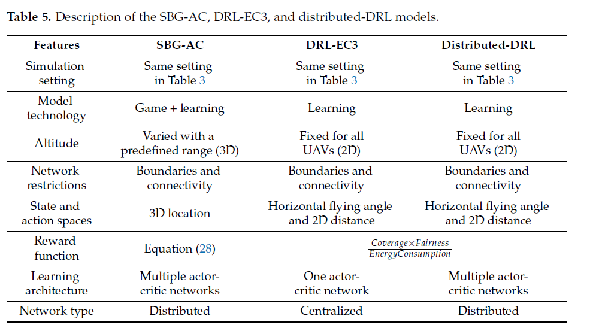

- **Key paper** : Distributed Energy-Efficient Multi-UAV Navigation for Long-Term Communication Coverage by Deep Reinforcement Learning : Chi Harold Liu , Senior Member, IEEE, Xiaoxin Ma, Xudong Gao, and Jian Tang , Fellow, IEEE

- Energy-Efficient UAV Control for Effective and Fair Communication Coverage: A Deep Reinforcement Learning Approach : Chi Harold Liu , Senior Member, IEEE, Zheyu Chen, Jian Tang , Senior Member, IEEE, Jie Xu, and Chengzhe Piao

- [Github](https://github.com/BIT-MCS/DRL-EC3)

**Pending**:

- Understanding code and verifying it is actually implementing MADDPG in CTDE paradigm or not.
- Removing dependency conflicts and running code in correct python version and tf version.
- Understanding how the environment is operating.
- Understanding use of images and why is CNN/RNN included in code.

Note : Including this line in the python file you are executing may be helpful : `sys.path.append(os.path.dirname(os.path.dirname(os.path.abspath(__file__))))`

**My summary of above papers** : First for 2nd paper which is more basic, after that for 1st paper.

**More info related to above** :

Liu et al. proposed a coverage method to have a system of UAVs cover an area and provide communication connectivity while maintaining energy efficiency and fairness of coverage. The authors utilize an actor–critic-based DDPG algorithm. Simulation experiments were carried out with up to 10 UAVs. For a similar communication coverage application, Liu et al. proposed that the UAVs have their own actor-critic networks for a fully-distributed control framework to maximize temporal mean coverage reward.

Due to the unlimited action space for
the coverage and energy control problem in the UAV network, a deep deterministic policy
gradient (DDPG) method can be used. In this research,
the control problem is complex since it needs to optimize four objectives at the same time:
coverage ability, energy consumption, connectivity, and fairness. Therefore, the DDPG is a
promising solution, and it can be used along with the designed utility of the game model
to achieve more coverage, less energy consumption, and high fairness, while keeping the
UAVs connected all the time. It can also deal with complex state spaces and with
time-varying environments, and it uses powerful deep neural networks (DNNs) to assist
the UAV in making decisions and providing high-quality services for the UAV network.
Moreover, the DDPG has the ability to deal with unknown environments and emergency
scenarios, and it enhances the robustness and reduces the calculation cost of the UAVs.

DRL-EC3 :  Objective -> Maximize energy efficiency; 2D model; Reward : Coverage score, fairness index and energy consumption; For 5 to 10 UAVs

---
