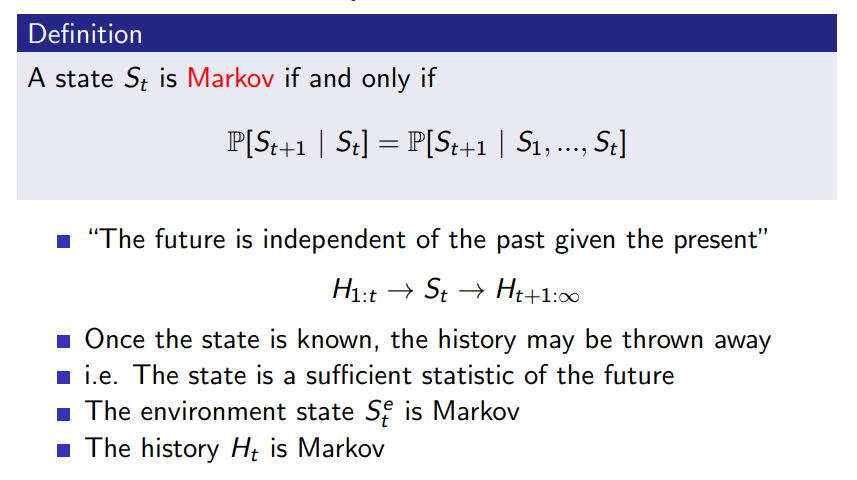
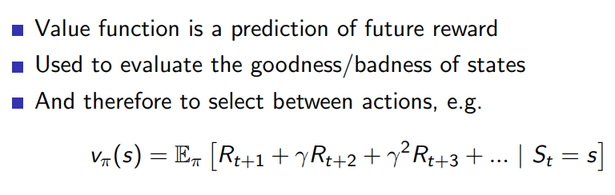

# Reinforcement Learning - Intro

An approach which tries to find the optimal way of making decisions => Present in different forms in several fields.

What makes reinforcement learning different from other machine learning paradigms?

- There is no supervisor, only a reward signal
- Feedback is delayed, not instantaneous
- Time really matters (sequential, non i.i.d data)
- Agent's actions affect the subsequent data it receives (since agent can influence the environment)

Classic example : Robot in a maze

## Rewards

- A reward Rt is a scalar feedback signal.
- Indicates how well agent is doing at step t
- The agent's job is to maximise cumulative reward

Reinforcement learning is based on the reward hypothesis.

Reward Hypothesis : 

All goals can be described as the maximisation of some expected cumulative reward.

A scalar reward is emphasised to make it easy to compare two values.

## Sequential Decision Making

- Goal: select actions to maximise total future reward
- Actions may have long term consequences
- Reward may be delayed
- It may be better to sacrifice immediate reward to gain more long-term reward.

## Agent and Environment

We build an agent that follows an algo fed in its brain which will choose actions At based on observations Ot and reward signal Rt. Our goal is to find right algo.

Environment is what the agent interacts with. It generates observations, tells reward and is influenced by the actions. 

The time series of observations, rewards and actions is our data. 

## History and State

History : Sequence of observations, rewards and actions (ie all observable variables upto time t)

Ht = O1, R1, A1, ..., At-1, Ot, Rt

What happens next depends on the history:
- The agent selects actions
- The environment selects observations/rewards

State is the information used to determine what happens next (summary of history).

Formally, state is a function of the history: 

St = f(Ht)

### Environment State

The environment state Se_t is the environment's private representation
i.e. whatever data the
environment uses to pick the
next observation/reward. 

The environment state is not
usually visible to the agent.

Hence our algo can't depend on environment state since it may be invisible/irrelevant.

### Agent State

The agent state Sa_t is the
agent's internal
representation i.e. whatever information
the agent uses to pick the
next action.

It is the information
used by reinforcement
learning algorithms.

So our state representation affects our decision.

It can be any function of
history:

Sa_t = f (Ht) 

### Information State

An information state (a.k.a. Markov state) contains all useful
information from the history.

**Fully Observable Environments**

Full observability: agent directly
observes environment state

Ot = Sa_t = Se_t

which implies

Agent state = environment
state = information state

Formally, this is a Markov
decision process (MDP)

**Partial Observable Environments**

**Episode** : Episode is the sequence of interactions at end of which the agent ends in a terminal state.

## Parts of RL agent

An RL agent may include one or more of these components:

### Policy

Agent's behaviour function

It is a map from state to action, e.g.
- Deterministic policy: a = π(s)
- Stochastic policy: π(a|s) = P[At = a|St = s]

### Value function

### Model

Agent's representation of the environment

It is not necessary to build a model of environment.

## Categorizing RL agents

A)
1) Value Based : Has a value fn; policy is implicit
2) Policy Based : No value fn; just has a policy
3) Actor Critic : Has policy and value fn

B)
1) Model Free : No model; Has policy and/or value function
2) Model Based : Has a model

## Problems within RL

### Learning and Planning

Two fundamental problems in sequential decision making : 

1. Reinforcement Learning:
- The environment is initially unknown
- The agent interacts with the environment
- The agent improves its policy

2. Planning:
- A model of the environment is known
- The agent performs computations with its model (without any
external interaction with real environment)
- The agent improves its policy
- a.k.a. deliberation, reasoning, introspection, pondering,
thought, search

### Exploration and Exploitation

- Reinforcement learning is like trial-and-error learning
- The agent should discover a good policy from its experiences of the environment without losing too much reward along the way
- Exploration finds more information about the environment
- Exploitation exploits known information to maximise reward
- It is usually important to explore as well as exploit (**Balance**)

Examples : 

1. Restaurant Selection
   
    Exploitation -  Go to your favourite restaurant
    
    Exploration - Try a new restaurant

2. Game Playing
 
    Exploitation - Play the move you believe is best
    
    Exploration - Play an experimental move

### Prediction and Control

Prediction: evaluate the future (given a policy)

Control: optimise the future (find the best policy)