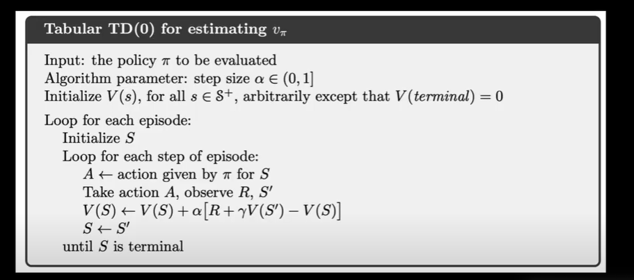
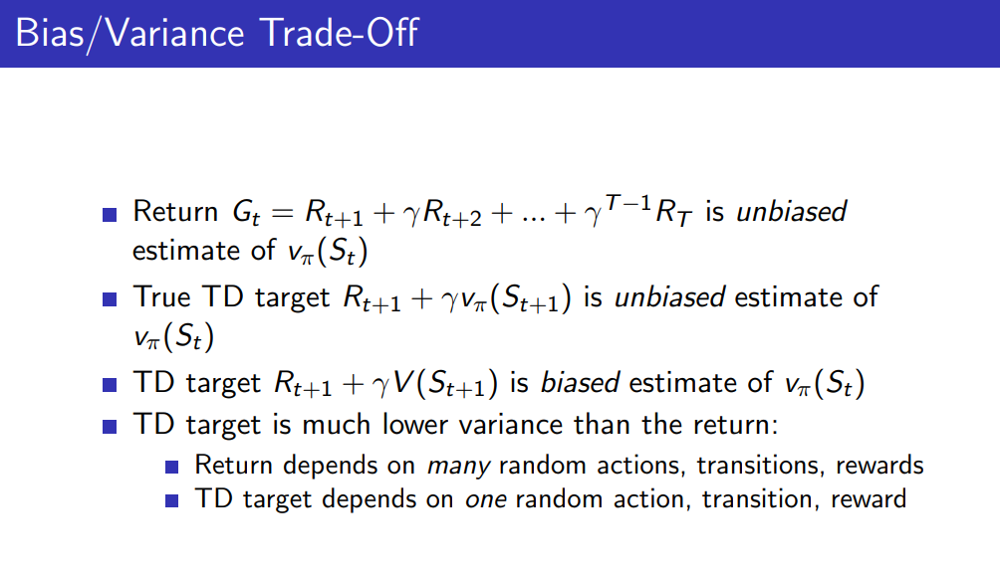

## Temporal Difference (TD) learning

If needed : go through RL Markov Maths images (and if time silver_2.pdf)

Temporal Difference Learning is a method that value-based RL algos use to iteratively learn v or q values.

The idea behind TD learning is to improve the way we do **model-free learning**. To do this, it combines the ideas from Monte Carlo and dynamic programming (DP):

Similarly to Monte Carlo methods, TD methods can work in a model-free learning. Similarly to DP, TD methods update the value estimates based partially on other estimates, without having to go through the entire episode (they bootstrap).

The above TD update is called TD(0) or one-step TD. That is, because it updates the value following the next state (St+1).

These values are adjusted as you go across different time steps (hence temporal) through multiple episodes.

**Learning rate (alpha)** : How much do you wish to update at each step (for deterministic, alpha = 1)

Thus, TD Learning is **online** and can learn from incomplete sequences.  That is, we don’t need to wait until the end of an episode — just until the next time step. Also, it also has lower variance than Monte Carlo. 

 

vπ(St+1) <- true value of value fn, V(st+1) <- our current best guess of value fn

SARSA : On-policy TD learning for model free control

Q Learning : Off-policy TD learning for model free control

---

### SARSA

On-policy TD learning for optimal q values.

Behaviour = Target policy = Epsilon-greedy

**Theorem** : Sarsa converges to the optimal action-value function, Q(s, a) → q∗(s, a).

---

### n-step TD

n-step methods span a spectrum with
MC methods at one end and TD(0) methods at the other. The best methods are
often intermediate between the two extremes. n-step TD methods allow lookahead of n steps in future. The methods that use n-step updates are still TD methods because they still change
an earlier estimate based on how it differs from a later estimate. Now the later estimate
is not one step later, but n steps later.

**n-step Sarsa**

---

### TD(λ)

Idea is to average n-step returns for all n.

**Forward View Sarsa(λ)**

