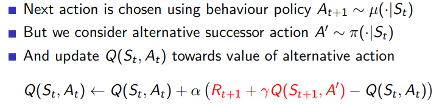
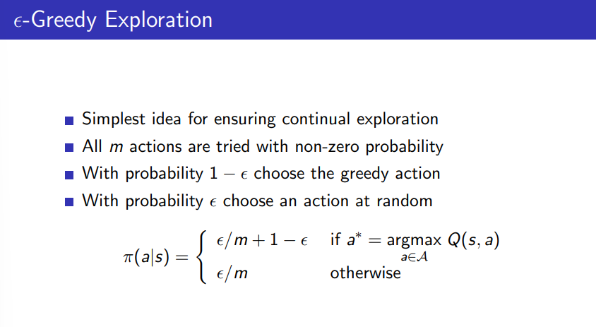
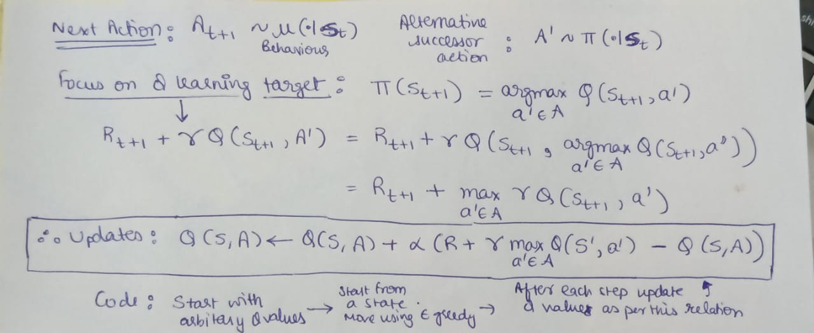
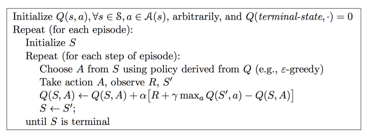
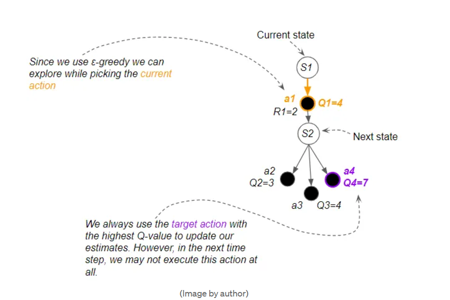

# Q-Learning

If needed : go through RL Markov Maths images (and if time silver_2.pdf)

Most real world problems are model-free control

Part of model-free control : Optimise the value function and find best optimal policy of an unknown MDP or an MDP that is too complex to use.

**Target policy** : Policy agent is trying to learn

**Behaviour policy** : Policy agent uses to learn target policy (it is how it behaves during learning)

**On-policy learning** : Target policy = Behaviour policy

**Off-policy learning** : Target policy not equal to behaviour policy

---

## Q learning

Off policy, model-free, value-based reinforcement learning algo which uses TD(0)

Being model free implies that in Q-learning, the agent does not know state transition probabilities or rewards. The agent only discovers that there is a reward for going from one state to another via a given action when it does so and receives a reward. Similarly, it only figures out what transitions are available from a given state by ending up in that state and looking at its options. 

Current Q values can be stored in a table which are updated through several episodes.

Target policy : greedy

Behaviour policy : epsilon-greedy (allows exploration)

**Epsilon-greedy exploration**

We can explore and discover new paths for actions that we execute.
However, when we update Q-value estimates to improve them, we always use the best Q-value, even though that action may not get executed.

**Theorem** : Q-learning control converges to the optimal action-value function, Q(s, a) → q∗(s, a).