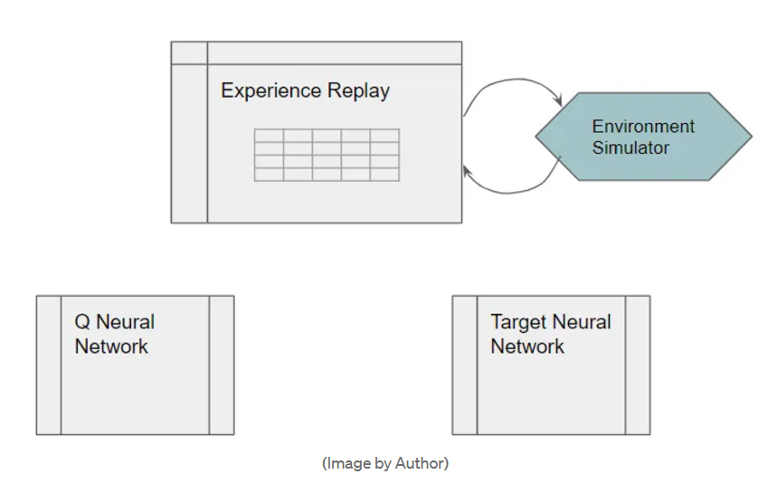

# Deep Q-Networks

Since Q-table may become too big, it may be replaced by a function. 

Since neural networks are excellent at modeling complex functions, we can use a neural network, which we call a Deep Q Network, to estimate this Q function. Typically CNNs are used.

Q learning is about learning Q values in a table, Deep Q learning is about learning parameters of the Q Network.

Q network is randomly initialized. Goal is to compute and compare loss function of current Q network with that of ideal or target network. Both networks have same architecture.

Using the loss, we update parameters of Q network using backpropagation to minimise it.

The underlying principle of a Deep Q Network is very similar to the Q Learning algorithm. It uses the same notion of dual actions: a current Q-value using exploration and a target Q-value which is greedy, for its update logic to improve its Q-value estimates.

## Phase 1 : Data collection

After randonly initializing the network a state is chosen and fed to the network.

The no of neurons in output layer is equal to no of actions. It emits q(s, a) for every a, we choose a in epsilon greedy fashion. 

This leads us to a next state and some immediate reward. The tuple of (state, action, reward, next_state) is stored in a buffer called experience relay buffer.

This data hence produced is used to train the network.

## Phase 2 : Training DQN

Initially target and Q network are identical.

Take a random batch of your tuples from the buffer (random to break temporal correlation).

Pass state from tuple to Q network and get q(s, a) for action mentioned in tuple.

Pass next state to target network and get max q(s,a) for all a.

Target value = immediate reward + gamma * (max q)

Find their MSE. Backpropagate this loss to DQN to update its parameters. Target network stays fixed (to avoid moving target and have stable learning)

But after every fixed no of steps copy Q network weights to target network so that it also improves.

Repeat for multiple episodes.