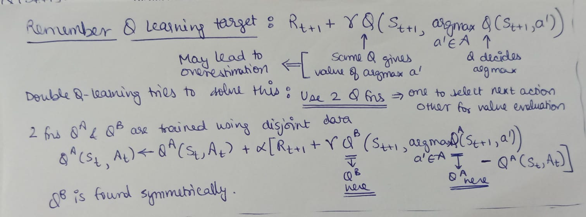

# Double Deep Q Network

**Double Q-learning** : 

**DDQN** :

Double Q-learning when combined with deep learning led to Double DQN.

Although not fully decoupled, the target network in the DQN architecture provides
a natural candidate for the second value function, without
having to introduce additional networks. We therefore can evaluate the greedy policy according to the online
network, but use the target network to estimate its value.

The update to the target network stays unchanged from
DQN, and remains a periodic copy of the online network.

Since DDQN solved overestimation issue, it outperforms DQN generally.