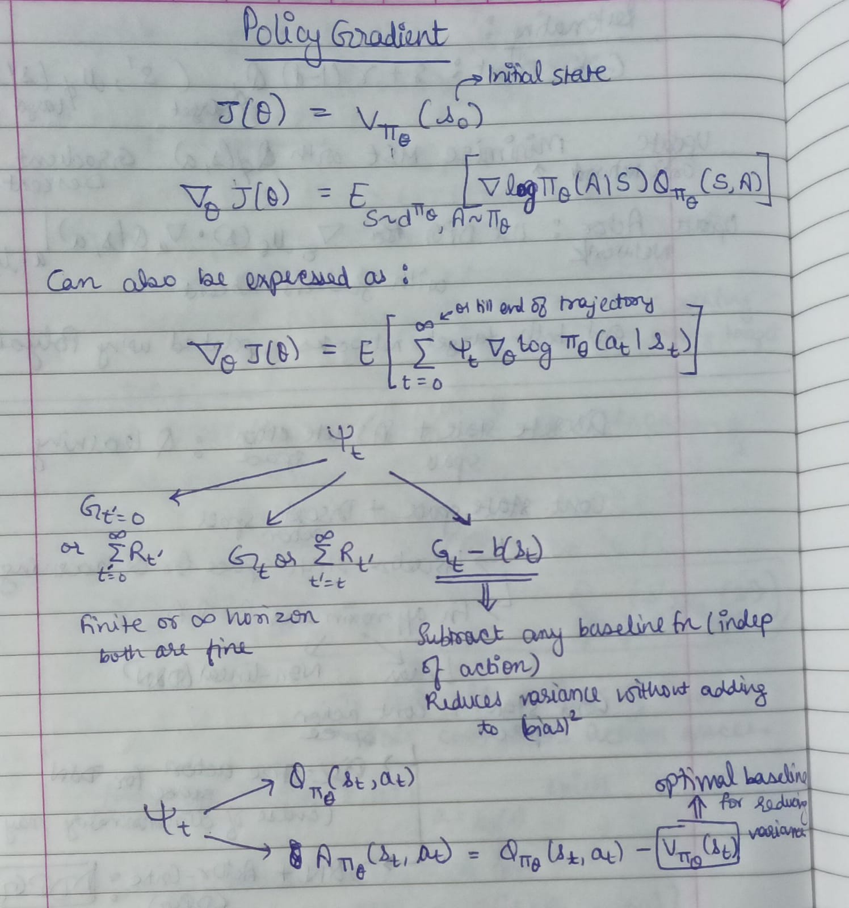
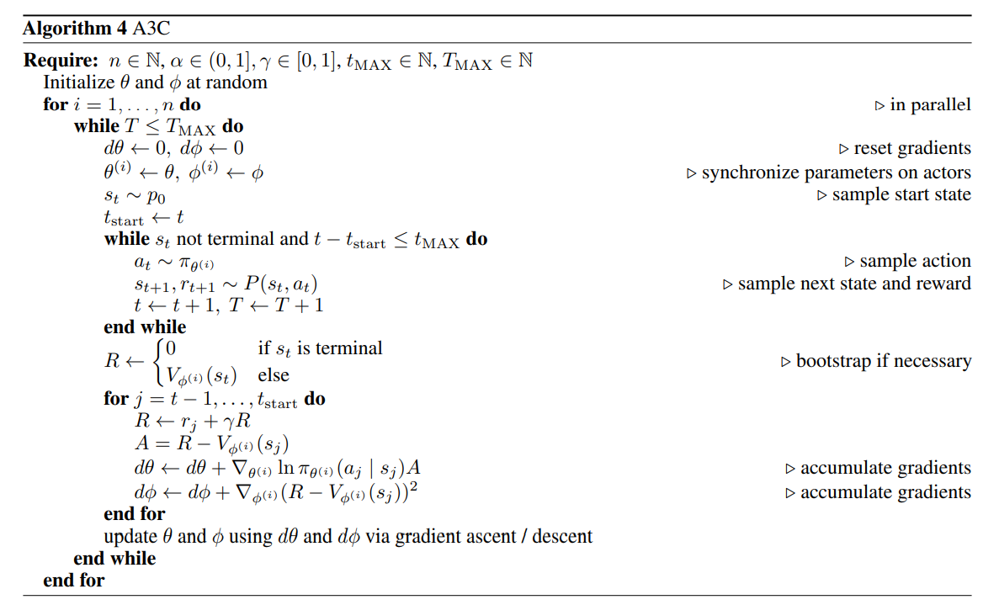

# Policy Gradients

Extra info, proofs, rough notes and details in `policy_gradients_rough_notes/`. Optional to see.

Till now we looked at value based learning  where tried to approximate the true value function using some parameters. A policy was generated implicitly from the value function.

Now we move to policy based learning where we directly parametrize the policy and adjust its parameters $\theta$ to maximise some objective function $J(\theta)$.

**Actor-critic methods** : Have two models - for a learned policy and a learned value function. The two models may share hidden layers. Critic network updates the value function parameters and depending on the algorithm it could be action-value or state-value. Actor updates the policy parameters in the direction suggested by the critic.

---

Define $A_\pi(s, a) = Q_\pi(s, a) - V_\pi(s)$ as advantage function.

Denote $G_t$ or return at each timestep (typically discounted) as rtgs (rewards-to-go).

---

$J(\theta)$ can be modelled as expected return starting from an initial state. It would depend on state distribution and directly finding its gradient would be tough since the environment is generally unknown and it is difficult to estimate the effect on the state distribution by a policy update.

Luckily, the policy gradient theorem provides a nice reformation of the derivative of the objective function to not involve the derivative of the state distribution and give it in form that can be easily used to find gradient using any DL library. 

Skipping the proofs and details and jumping to the crux :

Thus we can estimate policy gradient as mean over all timesteps of $\nabla_{\theta} \log \pi_{\theta}(a_t |s_t)  A_{\pi_{\theta}}(s_t, a_t)$ (or some other form).

Structure of policy gradient based algorithms :

1. Get trajectories as per current policy
2. Find policy gradient. Mostly use $Q(s, a)$ or $A(s, a)$ form. Since their true value is unknown, we need to use an estimate.
   -  A policy-based method like REINFORCE will use rtgs as estimate for $Q(s, a)$.
   -  An actor-critic method will use a neural network for approximating how good the policy is. If using $A(s, a)$ form, advantage fn needs to be estimated. Advantage function can be reduced to an expression involving only $V_\phi(s)$ so only one function needs to be learnt. Advantage function can be approximated as `Q-estimate (using either rtgs or TD(0) or n-step TD target) - V-estimate` or using something like `GAE`. rtgs is unbiased but has higher variance compared to TD estimation or GAE.
   
      Key difference between them is that in policy-based, actor model receives actual rtgs to update policy while in actor-critic, actor model receives a modified value adjusted by critic network which is also updating itself.
   
      An actor-critic method will update $V_\phi(s)$ by fitting to a target (can be rtgs or TD(0) or n-step TD target) using gradient descent on MSE.

3. Improve policy using gradient ascent. Loop to step 1.

---

For a stochastic policy, policy network will take in a state and output a probability distribution over the action space. (Look at `7_dpg_ddpg.md` for deterministic policies) To output a probability distribution, for a discrete action space a categorical distribution is achieved typically using softmax. While for a continuous action space, it is common to use a diagonal gaussian policy with mean coming from the network. Std deviation may be learnt as well or be independent.

Details on REINFORCE, Vanilla Policy Gradient and other algos in `policy_gradients_rough_notes/`. See them if desired.

Here presenting A2C and A3C only :

A3C - Asynchronous Advantage Actor-Critic (and A2C - Advantage Actor-Critic, its synchronous version) are the most basic actor-critic algorithms. They are **on-policy** and perform gradient ascent on $\nabla_{\theta} \log \pi_{\theta}(a_t |s_t)  A_{\pi_{\theta}}(s_t, a_t)$. 

A common trick : for advantage estimation, we may use rtgs as Q estimate and critic network target when computing for batch vs TD target as Q estimate and critic network target when computing online. (Note that batch computation involves mean for actor loss while online does not)

A3C :  

Several actors $π^{(1)}_θ, . . . , π^{(k)}_θ$ are used to decrease noise by accumulating the gradients over
multiple trajectories. These accumulated gradients are applied to a centrally maintained copy of $θ$, which is then
redistributed to each actor. By doing this asynchronously, each actor has a potentially unique set of parameters at any
point in time compared to the other actors. This decreases the correlation of the sampled trajectories across actors,
which can further stabilize learning. The parameters get updated by a little bit in the direction of each training thread independently.

A2C :

A2C is a synchronous, deterministic version of A3C. In A3C each agent talks to the global parameters independently, so it is possible sometimes the thread-specific agents would be playing with policies of different versions and therefore the aggregated update would not be optimal. To resolve the inconsistency, a coordinator in A2C waits for all the parallel actors to finish their work before updating the global parameters and then in the next iteration parallel actors starts from the same policy. The synchronized gradient update keeps the training more cohesive and potentially to make convergence faster. A2C has been shown to be able to utilize GPUs more efficiently and work better with large batch sizes while achieving same or better performance than A3C.

---

**Tradeoffs between policy-based and value-based learning**

Policy-based methods can learn deterministic policies as well as stochastic policies. On the other hand, with value-based solutions, the optimal policy is derived from the optimal Q-value by picking the action with the highest Q-value. Thus they can learn only deterministic policies.

Also policy-based methods can be used in high-dimensional or continuous action spaces where Q-learning methods are not effective.

Since policy-based methods find the policy directly, they are usually more efficient than value-based methods, in terms of training time.

But, Q-learning methods gain the advantage of being substantially more sample efficient because they can reuse data more effectively than policy optimization techniques.

---