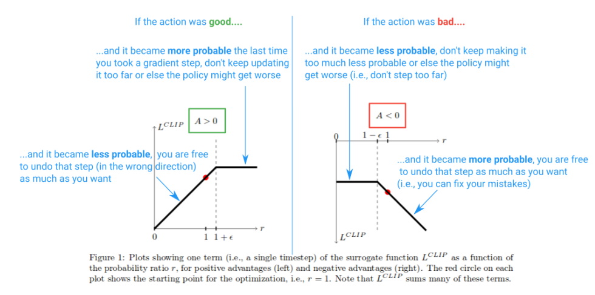

## PPO (Proximal Policy Optimization)

Extra info, proofs, rough notes and details in `policy_gradients_rough_notes/`. Optional to see.

PPO is an **on-policy** algorithm. It can be used for environments with either discrete or continuous action spaces. It is an actor-critic style algorithm with a surrogate objective fn.

To improve training stability, we should avoid parameter updates that change the policy too much at one step. PPO is motivated by this: how to take the biggest possible improvement step on a policy using the data we currently have, without stepping so far that we accidentally cause performance collapse? For this, PPO uses first-order functions and is much simpler to implement than TRPO or others.

There are two primary variants of PPO: PPO-Penalty and PPO-Clip.

- PPO-Penalty approximately solves a KL-constrained update, but penalizes the KL-divergence in the objective function instead of making it a hard constraint, and automatically adjusts the penalty coefficient over the course of training so that it’s scaled appropriately.

- PPO-Clip doesn’t have a KL-divergence term in the objective and doesn’t have a constraint at all. Instead it relies on specialized clipping in the objective function to remove incentives for the new policy to get far from the old policy.

We’ll focus only on PPO-Clip.

We only clip if the objective function would
improve. If the policy is changed in the opposite direction such that $J^{\text{CLIP}}(\theta)$ decreases, $r(\theta)$ is not clipped (since there is min). This is because it was a step in the wrong direction (e.g., the action was good but we accidentally made it less probable). If we had not included the min in the objective function, these regions would be flat (gradient = 0, no update to theta) and we would be prevented from fixing mistakes.

Thus, the clipping limits the effective change you can make at each step in order to improve stability, and the min allows us to fix our mistakes in case we screwed it up.

---

**Must see implementation in `key_implementations/ppo.py`.**

PPO allows you to run multiple epochs of gradient ascent on your samples without causing destructively large policy updates because of the Clipped Surrogate Objective function. This allows you to squeeze more out of your data and reduce sample inefficiency. This is not possible for vanilla policy gradient methods.

---

**Further PPO optimizations** :

Blog : https://medium.com/@z4xia/coding-ppo-from-scratch-with-pytorch-part-4-4-4e21f4a63e5c

Code : https://github.com/ericyangyu/PPO-for-Beginners/blob/master/part4/ppo_for_beginners/ppo_optimized.py

---