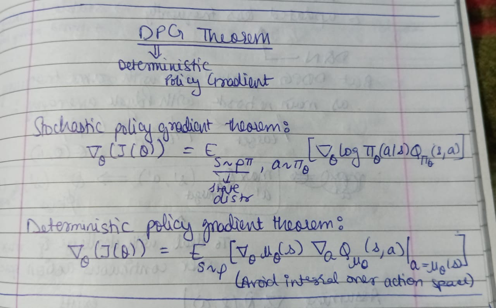
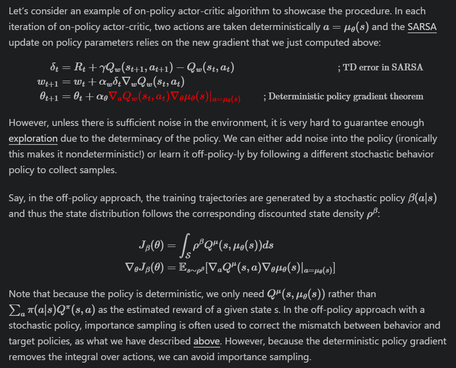
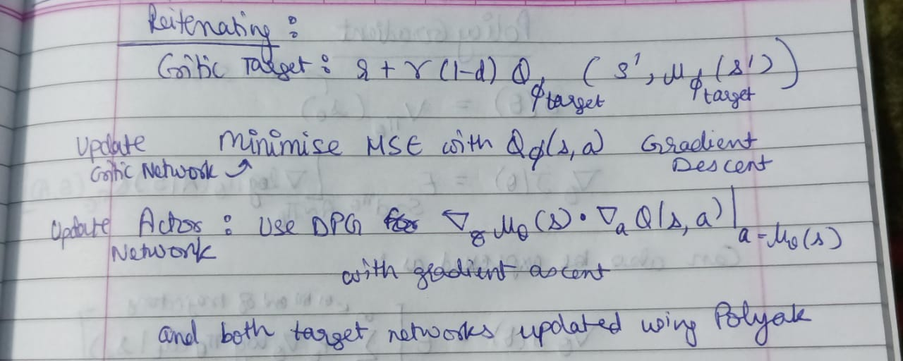
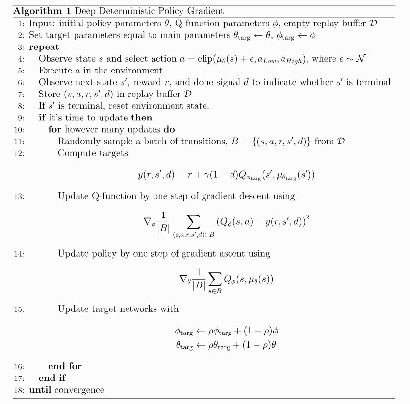

Extra info, proofs, rough notes and details in `policy_gradients_rough_notes/`. Optional to see.

## DPG (Deterministic Policy Gradient)

Instead of a stochastic policy 
$\pi_\theta(a|s)$ (probability distribution), DPG calculates gradients for a deterministic policy $a = \mu_\theta(s)$.

Compared to the deterministic policy, we expect the stochastic policy to require more samples as it integrates the data over the whole state and action space.

The deterministic policy gradient can be plugged into common policy gradient frameworks.

In the off-policy algorithm in above image, the critic uses Q-learning updates to estimate the Q function.

## DDPG (Deep Deterministic Policy Gradient)

**Must see implementation in `key_implementations/ddpg.py`.**

DDPG is a model-free off-policy actor-critic algorithm meant for continuous action spaces (since we want Q to be differentiable wrt a that's why). It learns a deterministic policy and a Q function simultaneously. 

DDPG is found to work well for physical control problems even when input for such problems is image or video. DDPG also typically involves batch normalization.

DDPG combines DQN with DPG. DDPG takes ideas of replay buffer and target network from DQN and applies them to DPG. DQN works in discrete action spaces, and DDPG extends it to continuous action spaces. How?

If you know the optimal action-value function $Q^*(s,a)$, then in any given state, the optimal action $a^*(s)$ can be found by solving $a^*(s) = \arg \max_a Q^*(s,a)$.

When there are a finite number of discrete actions, the max poses no problem. But when the action space is continuous, we can’t exhaustively evaluate the action space. Using a normal optimization algorithm instead would make calculating $\max_a Q^*(s,a)$ a painfully expensive subroutine.

Because the action space is continuous, the function $Q^*(s,a)$ is presumed to be differentiable wrt $a$. This allows us to set up an efficient DPG based algorithm for learning a deterministic policy $\mu(s)$. Then, instead of running an expensive optimization subroutine each time we wish to compute $\max_a Q(s,a)$, we can approximate it with $\max_a Q(s,a) \approx Q(s,\mu(s))$. DDPG uses a target policy network to learn  $\mu_\theta(s)$ for giving an action which maximizes $Q_{\phi_{\text{targ}}}$.

To make DDPG policies explore better, we add noise to their actions at training time. The authors of the original DDPG paper recommended time-correlated OU noise, but more recent results suggest that uncorrelated, mean-zero Gaussian noise works perfectly well. During testing, to see how well the policy exploits what it has learned, we do not add noise to the actions.

---