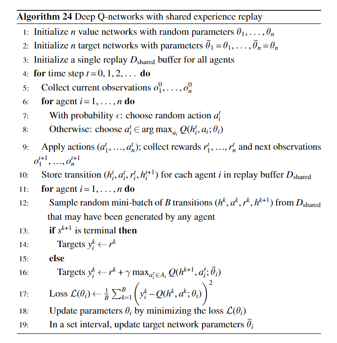

The standard definition of an MDP is for a single agent, who controls all of the actions. In a multi-agent system, the effects of actions and the rewards we receive are dependent also on the actions of other agents. They can be cooperative or adversarial or a mix of both. 

“Game” is a more general term to describe a problem that involves multiple agents or players.

- Normal form games model non-sequential games where agents take actions simultaneously, but the reward or payoff that they receive is dependent on the moves of the other agents. There is no evolving environment state however.

- An extensive form game is a sequential game. There are multiple players who can take moves in the game, but not simultaneously.

- A stochastic game is a generalisation of above two types of games. Here the moves are made simultaneously and the environment state evolves as a result of actions of agents. A stochastic game is also a generalization of a MDP in the sense that putting no of agents as 1 reduces it to a MDP.

Let's focus on stochastic games:

A **stochastic game** is a tuple $G = (S, A^1, \ldots A^n, r^1, \ldots, r^n, P, \gamma)$ where:

- $S$ is a set of states                                     
- $A^j$ is the set of actions for agent $j$, 
- $P: S \times A^1 \times \ldots A^n \rightarrow \Omega(S)$ is a transition function that defines the probability of arriving in a state given a starting state and the actions chosen by all players
- $r^j : S \times A^1 \times \ldots A^n \times S \rightarrow \mathbb{R}$ is the reward function for agent $j$
- $\gamma$ is the discount factor
- $\mu: S \rightarrow [0,1]$ is the initial state distribution

We'll focus on fully-observable games only.

Similar to MDPs, stochastic games have the Markov property that is the
probability of the next state and reward depends only on current state and joint action.

Games can be categorized based on the relationship between the agents’
rewards. In zero-sum games, the agents’ rewards always sum up to zero. In
common-reward games, each agent receives the same reward. General-sum
games are the most general games and do not define any restrictions on the
relationship of reward functions.

In a stochastic game, the solution is a set of policies: one policy $\pi^j$ for each agent $j$. The **joint policy** of all agents is simply

$$
\pi = [\pi^1, \ldots \pi^n]
$$

The objective for an agent is to maximise its own reward:

$$
V_{\pi^j}(s) = E_{\pi^j}[\, \sum_{i} \gamma^i \, r^j(s_i, a, s_{i+1}) \ | \ s_0 = s, a = \pi(s_i)]
$$

Note that $a = \pi(s_i)$ is the joint action of all agents. So, each agent's objective is to maximise its own expected reward considering the possible actions of all other agents.

Multi-Agent Reinforcement Learning approaches for solving stochastic games:

- Decentralized : All agents are trained independently. No info is shared between the agents.
  
  Benefits : 
  - Simpler implementation since no communication needed.
  - Smaller input space.

  Challenges : 
  - Difficult to learn without info sharing.
  - Multiple agents interacting make environment non-stationery (underlying MDP changes over time) so many of existing RL algorithms can't be applied. Kind of like moving targets. Can lead to situations where the solution never converges.
  - Symmetric states (just positions of identical agents swapped) maybe considered different and relearnt even though optimal action is same for both.

- Centralized : Higher level process which collects experiences from all agents and learns a policy which is then distributed back to the agents. 
  
  Especially beneficial if agents are identical since a single policy needs to be learnt for all of them. The policy is learnt considering the agents as a a larger entity and hence doesn't matter which is where since they are interchangeable. 
  
  Thus in centralized, agents learn from collective experiences. Also the environment is stationery since all are a larger entity and they know each other's policy changes.

Many single agent RL algorithms like SARSA, Q learning, policy-based methods and actor-critic methods can be extended to multi-agent environment by assuming rest of the agents to be part of the environment which together determine our rewards. An agent learns independently only from its own observation history, actions and rewards. This is hence known as **independent learning**. 

In multi-agent settings, on-policy algorithms like independent REINFORCE have an
advantage over off-policy algorithms, such as independent DQN, since they use most recent experiences and hence learn from current policies of other agents.

However most of these algorithms face problem of non-stationarity since they assume other agents as part of the environment which have changing policies and thus make the environment non-stationery. This is a limitation and can be mitigated to some extent by using **CTDE (Centralized Training and Decentralized Execution)**. 

Under CTDE paradigm,
agents can share information during training to stabilize learning, as long as
they are still able to execute their policies in a decentralized manner. A multi-agent actor-critic algorithm, for
example, may train a policy with a centralized critic that can be conditioned
on the joint observation history and, thereby, provide more accurate estimation
of values compared to a critic that only receives a single agent’s observation
history. By having
access to information about all other agents, a centralized critic may adapt faster
to the non-stationary policies of other agents. During execution, the value function is no longer needed since the
action selection is done by the policy. To enable decentralized execution, the
policies of agents are only conditioned on their local observation histories.

We may also have centralized action-value critics which learn an action value function conditioned on joint observations and joint actions.

There are also other sophisticated techniques developed only for the purpose of multi-agent RL.

---

Multi-agent centralized DQN:

**Multi-agent centralized SARSA** learning will follow a similar algorithm just with a different Q function target $y_i = r_i^k + \gamma Q_i(h_i^{k+1}, a^{k+1}; \theta_i)$

---

