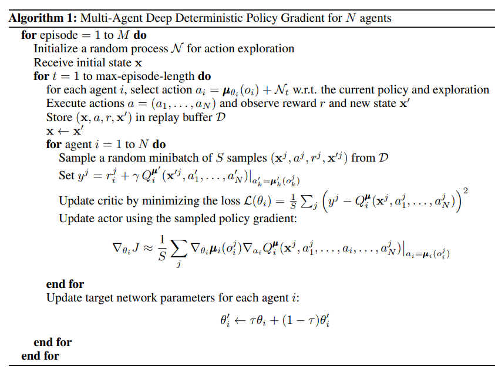

Multi-Agent DDPG (MADDPG) is an actor-critic algorithm that extends DDPG to an environment with multiple agents. It is proposed for stochastic games. It is applicable to cooperative, competitive and even mixed interaction.

To handle non-stationarity, it uses *decentralized actors and a centralized critic* (CTDE paradigm). 

The critic in MADDPG learns a centralized action-value function $Q_i^\mu(x, a_1, ..., a_N)$ for the i-th agent. Each $Q_i^\mu$ is learned separately for $i = 1,...,N$ and therefore multiple agents can have arbitrary reward structures, including conflicting rewards in a competitive setting. $x$ represents joint observation and possibly some more information. Experience replay buffer records experiences of all agents. $\mu = \{\mu_1, ..., \mu_N\}$ represents set of all agent policies and $\mu'$ represents set of policies with delayed parameters $\theta_i'$.

**Critic update**:

$$\mathcal{L}(\theta_i) = \mathbb{E}[(Q_i^\mu(x, a_1, ...,a_N) - y)^2]$$ 

where $y = r_i + \gamma Q_i^{\mu'}(x', a_1', ..., a_N')|_{a_j' = \mu_j'(o_j)}$

Meanwhile, multiple actors, one for each agent, are updating the policy parameters $\theta_i$ for their deterministic policy $\mu_i$ on their own.

**Actor Update**:

$$\nabla_{\theta_i}J(\mu_i) = \mathbb{E}[\nabla_{\theta_i}\mu_i(o_i) \nabla_{a_i}Q_i^\mu(x, a_1, ..., a_N)|_{a_i = \mu_i(o_i)}]$$

Clearly deterministic policy gradient is found by only using local observations but the centralized Q value provides info about the entire system.

A primary motivation behind MADDPG is that, if we know the actions taken by all agents, the
environment is stationary even as the policies change. This is not the case if we
do not explicitly condition on the actions of other agents, as done for most traditional RL methods.

Implementation links : 

- https://github.com/Git-123-Hub/maddpg-pettingzoo-pytorch
- https://github.com/xuehy/pytorch-maddpg/
- https://github.com/starry-sky6688/MADDPG

**Extra details about algorithm**:

Note that critic update requires knowledge of policies of other agents. To relax this assumption, we can approximate policies of other agents using observations. That is each agent $i$ can maintain an approximation $\hat{\mu}_i^j$ of true policy $\mu_j$. 

$\hat{\mu}_i^j$ is learnt by maximizing log prob of agent j's actions with an entropy regularizer.

Thus, loss function is :

$$\mathcal{L}(\phi_i^j) = -\mathbb{E}[ \log \hat{\mu}_i^j(a_j|o_j) + \lambda H(\hat{\mu}_i^j) ]$$

During critic update, we first update $\phi_i^j$. The critic target is found using target networks of approximate policies:

$$\hat{y} = r_i + \gamma Q_i^{\mu'}(x', \hat{\mu}_i'^{1}(o_1), ...,\mu_i'(o_i), ..., \hat{\mu}_i'^{N}(o_N))$$ 

where $\hat{\mu}_i'^{j}$ is the target network for approximate policy $\hat{\mu}_i^{j}$.

*Policy Ensembles*

To obtain multi-agent policies that have less possibility of overfitting to behaviour of competing agents and are more robust to policy changes,
we propose to train a collection of K different sub-policies. At each episode, we randomly select
one particular sub-policy for each agent to execute.

---

**Aside** : 

More on Entropy regularization:

For a distribution $P$, entropy $H(P) = \mathbb{E}_P[-\log P(x)]$

To promote exploration, agent receives an additional reward proportional to entropy of policy. Thus at any timestep t, reward = $R(s_t, a_t, s_{t+1}) + \alpha H(\pi(.|s_t))$. The entropy coefficient $\alpha$ can be adjusted for exploration-exploitation tradeoff. 

An entropy term may be made part of the objective function in different ways depending on the algorithm.

---